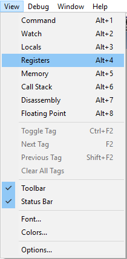

# x86-masm
Setup for assembling x86 assembly code with MASM

# Setup

```bash
# Clone this repository
git clone https://github.com/adam-mcdaniel/x86-masm
# Enter directory
cd x86-masm

# Write your code
nano your_code.asm

# Assemble and debug
.\assemble.bat your_code.asm
```

# Starting Template

To start writing x86 assembly, just copy paste the following code into your `.asm` file.

```asm
; ***********************************************************************
; *                     Your Program                                 
; ***********************************************************************

.386
.MODEL FLAT
ExitProcess PROTO NEAR32 stdcall, dwExitCode:DWORD
PUBLIC _start   ; make procedure _start public
; ***********************************************************************
; *                     Data Segment                                 
; ***********************************************************************
.DATA
	x DWORD 1
	y DWORD 1
	result DWORD ?

; ***********************************************************************
; *                     Stack Segment                                 
; ***********************************************************************
.STACK  4096
; ***********************************************************************
; *                     Code Segment                                  
; ***********************************************************************
.CODE
_start  PROC    NEAR32    ; start procedure called _start. Use flat, 32-bit address memory model
        mov eax, x      ; eax = x
        add eax, y      ; eax += y
        mov result, eax ; result = eax


; ***********************************************************************
; *                     Magic Segment                                  
; ***********************************************************************
exit:   EVEN
        INVOKE  ExitProcess, 0
_start  ENDP
        END
```

# Debugging

`assemble.bat` will automatically start the debugger, but you will need to do some extra steps to actually debug your program.

1. Click `step into`


2. View Registers


3. Arrange Windows


Now, whenever you click `step into`, the program will execute a single line of assembly code. To debug your program, view the registers while you execute your code line by line.